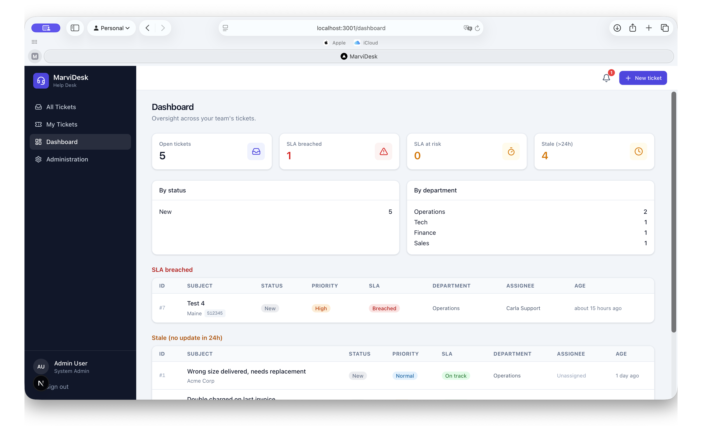
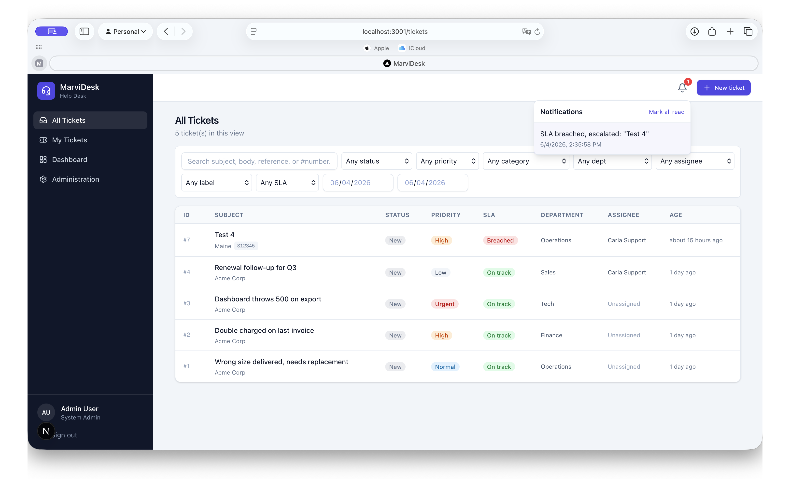
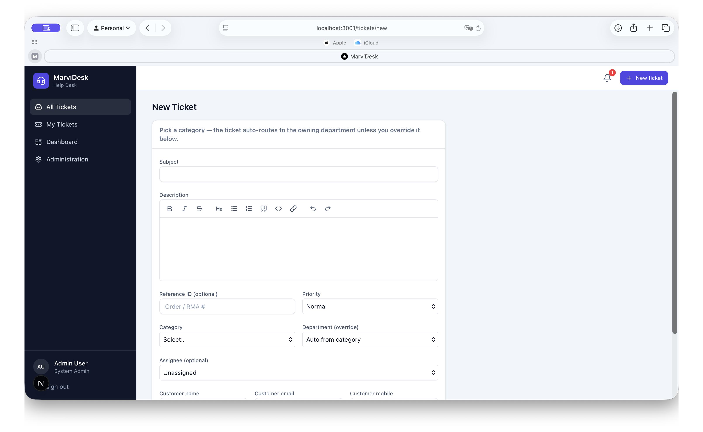
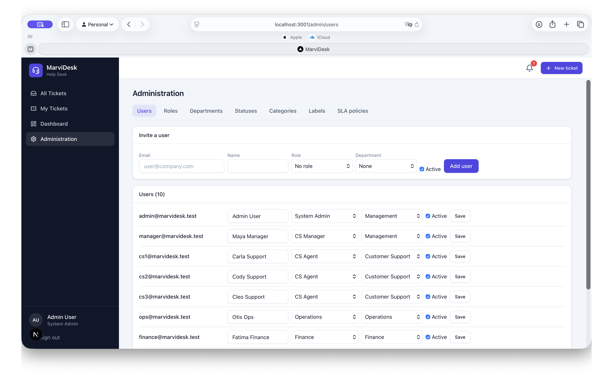

# MarviDesk

Internal ticketing & helpdesk. Customer Support agents create categorized
tickets that are auto-routed to the owning department (Operations, Finance,
Tech, Sales) or escalated to the CS Manager. Resolving teams work tickets in
their own scoped queue; everyone stays in sync through comments, @mentions,
watchers, in-app + email notifications, and an immutable audit trail.

## Screenshots

### Dashboard
Oversight across the team's tickets — open/at-risk/breached/stale stat cards,
breakdowns by status and department, and SLA-breached / stale queues.



### All Tickets
Searchable, faceted ticket list with status, priority and SLA badges, plus the
in-app notification center.



### New Ticket
Create a ticket with a rich-text description, category-based auto-routing (with
manual override), reference ID, assignee, and customer details.



### Administration
Manage users, roles & permissions, departments, statuses, categories, labels
and SLA policies — everything is configurable.



## Stack

- **Next.js 16** (App Router, TypeScript) + **Tailwind v4**
- **PostgreSQL 16** + **Prisma 6**
- **Auth.js v5** — Google + Microsoft Entra SSO (plus a dev-only email login)
- **BullMQ + Redis** — email + SLA background jobs
- **Nodemailer (SMTP)** outbound, generic inbound webhook (Postmark-compatible)
- **S3 / MinIO** — attachments
- **Docker Compose** for local services & single-VPS deploy

## Local development

```bash
# 1. Start backing services (Postgres, Redis, MinIO, Mailpit)
docker compose up -d postgres redis minio mailpit

# 2. Configure env
cp .env.example .env   # already generated with secrets in this repo

# 3. DB schema + seed (6 departments, 10 users, SLA policies, labels, demo tickets)
npm run db:push
npm run db:seed
npm run setup:s3       # create the attachments bucket

# 4. Run the app and the worker (two terminals)
npm run dev
npm run worker
```

Open http://localhost:3000. In development, sign in with the **Dev login** using
a seeded email — e.g. `admin@marvidesk.test`, `manager@marvidesk.test`,
`cs1@marvidesk.test`, `ops@marvidesk.test`, `finance@marvidesk.test`,
`tech1@marvidesk.test`, `sales@marvidesk.test`.

- Mailpit web UI (sent emails): http://localhost:8025
- MinIO console: http://localhost:9101

## Roles & access

| Role | Sees | Can |
| --- | --- | --- |
| CS Agent | tickets they created | create + route tickets |
| CS Manager | all CS-created tickets + own assignments | oversight dashboard; owns escalations |
| OPS / FINANCE / TECH / SALES | only their department's tickets | update status, comment, internal notes |
| System Admin | everything | manage users, labels, SLA policies |

Visibility is enforced by `ticketScope()` in `src/lib/access.ts`, ANDed into
every query — so a user can't reach another department's ticket even by direct
ID.

## Email

- **Outbound**: notifications (assignment, mention, status change, new comment,
  SLA, escalation) are queued and sent by the worker with a per-ticket
  `reply+<ticketId>@INBOUND_EMAIL_DOMAIN` reply-to.
- **Inbound**: point your provider's inbound webhook at
  `POST /api/inbound-email` with header `x-webhook-secret: $INBOUND_WEBHOOK_SECRET`.
  Replies are matched to the ticket via the reply token, appended as a comment,
  and de-duplicated on `MessageID`.

## SLAs

`SlaPolicy` defines first-response and resolution targets per priority
(admin-editable at `/admin/sla`). The worker recomputes SLA state every 5
minutes; tickets flip to **At risk** / **Breached** and a breach auto-escalates
(raises priority + notifies the CS Manager).

## Tests

```bash
npm test          # vitest: routing map, SLA derivation, RBAC scoping
npm run typecheck
npx tsx --env-file=.env scripts/verify.ts   # end-to-end service smoke test (needs DB+Redis)
```

## Production (single VPS)

1. Set real `AUTH_GOOGLE_*` / `AUTH_MICROSOFT_ENTRA_ID_*`, SMTP, S3 and
   `APP_URL` in `.env` (the dev login is disabled when `NODE_ENV=production`).
2. Edit `Caddyfile` with your domain.
3. Uncomment the `web` / `worker` / `caddy` services in `docker-compose.yml` and
   `docker compose up -d --build`.
4. Run migrations/seed against the prod DB (`npm run db:push`, `npm run db:seed`).
